# litelens-plugins

Official plugin repository for Litelens.

## Plugins

| Plugin | Description                                                      | Docs                                             |
| ------ | ---------------------------------------------------------------- | ------------------------------------------------ |
| Helm   | Integration with Helm package manager for Kubernetes deployments | [plugins/helm/README.md](plugins/helm/README.md) |

## Architecture: how a plugin talks to the host

Each plugin ships as two halves that run in different processes but are loaded together by the
host app at runtime: a **Go subprocess** (business logic, talks to Kubernetes) and a **frontend ES
module** (dynamically `import()`-ed into the host's own webview, so it shares the host's React
tree). The two halves — and the host — communicate over four independent channels, each scoped to
exactly what it needs to do:

<picture>
  <source media="(prefers-color-scheme: dark)" srcset="docs/architecture/architecture-dark.svg" />
  
</picture>

1. **Process lifecycle** (host → plugin, host-driven): the host spawns the plugin as an OS
   subprocess and parses its one-line JSON stdout handshake (`{"type":"READY","httpPort":...}`) to
   learn its HTTP port. This is inherent to running plugins as separate processes — only the host
   can manage an OS subprocess — and is the one place the host still drives the interaction.
2. **Business calls** (plugin frontend → plugin backend, bypasses the host): the plugin frontend
   fetches its backend's address once per mount (`GetPluginBackendAddr`, a Wails-bound method) and
   then calls `POST http://127.0.0.1:<port>/api/helm/<method>` directly — e.g. `listCharts`,
   `installChart`. The host never sees these payloads and has no static knowledge of what methods a
   plugin exposes; this is the inversion from the plugin repo's earlier gRPC `Invoke`/`dispatch()`
   relay, where every call was proxied through and known to the host.
3. **Control channel** (plugin → host, gRPC): the plugin dials back into the host over gRPC for two
   narrow, host-owned concerns the backend can't self-discover as a separate process — cluster
   context (it watches a stream for context switches made in the UI) and async progress events for
   long-running operations (install/upgrade/cleanup), which the host relays into the webview over
   its own Wails event bus for the plugin frontend's event bridge to consume.
4. **Host capability calls** (plugin frontend → host frontend, in-process): the plugin frontend
   calls `useClusterWideAPI()` from `@litelens/core` to reach host-only UI capabilities —
   `resourceLinks` (open a resource's detail drawer), `unifiedTray`, and nav/tray-family
   registration. This isn't IPC — `@litelens/core`'s import-map/vendor-shim mechanism means the
   plugin bundle calls straight into functions the host's own `main.tsx` injected at startup, in the
   same JS runtime, sharing the same React instance the plugin mounts into.

See [`CLAUDE.md`](CLAUDE.md) for the exact source files behind each channel, and
[`plugins/helm/README.md`](plugins/helm/README.md) for plugin-specific docs.
